Visualising spatial data: from R to shiny - workshop
================
Robin Lovelace

Introduction
============

These exercises aim to get you up-to-speed with the various ways of visualising spatial data with R. It's practical: you'll learn by doing. Rather than explain the pros, cons and use cases of each, this tutorial gets stuck straight in with the action, after a few introductory notes.

Programming is best learned by typing code, running it and experimenting, not by reading long texts or copying and pasting (although these activities can certainly help). I therefore recommend you work through the materials by typing the code chunks into new .R or .Rmd files. That way you can take ownership of the methods and write them in your style, in a way that is optimised for your learning. It should also encourage you to experiment and not follow the examples precisely: feel free to expand on certain code chunks or skip some examples. Applying the methods to your own datasets is strongly encouraged.

Pre-requisites
--------------

To run the code presented in this tutorial you will need to have installed the following packages:

``` r
pkgs = c(
  "sp",       # spatial data classes and functions
  "ggmap",    # maps the ggplot2 way
  "tmap",     # powerful and flexible mapping package
  "leaflet",  # interactive maps via the JavaScript library of the same name
  "mapview",  # a quick way to create interactive maps (depends on leaflet)
  "shiny",    # for converting your maps into online applications
  "OpenStreetMap", # for downloading OpenStreetMap tiles 
  "rasterVis",# raster visualisation (depends on the raster package)
  "dplyr",    # data manipulation package
  "tidyr"     # data reshaping package
)
```

They can all be installed with `install.packages(pkgs)`. Less time consuming in many cases will be to install only those packages that have not yet been installed, e.g. via:

``` r
(to_install = pkgs[!pkgs %in% installed.packages()])
if(length(to_install) > 0){
  install.packages(to_install)
}
```

It is worth keeping your packages and R version up-to-date. To ensure the former, run:

``` r
update.packages(oldPkgs = pkgs)
```

Data
----

Geographic data visualisation in R is part of a wider process: command line GIS. It will normally be done in tandem with other GIS operations. We deliberately focus on visualisation here to give a rapid overview of what is possible using a few datasets, for consistency between the methods. Context helps understanding, however, so we begin with a brief description of the datasets used.

There are 2 branches of spatial data: raster and vector. Rasters are 2D images composed of pixels that treat space as a series of uniform blocks or raster 'cells'. They be represented as a matrix or array. Vectors are 2D assemblages of points and edges in which the points (and the lines that join them) can exist anywhere in continuous space. Although some exotic data structures are possible (e.g. [voxels](https://en.wikipedia.org/wiki/Voxel)), the majority of spatial datasets can be represented by just 2 types of raster and 3 types of vector object:

-   Raster data
    -   Single band raster data: this the same as black and white image. We'll represented as a `RasterLayer` in the **raster** package.
    -   Multi-layered raster data: these are assemblages of multiple raster layers such as color bands (red, green, blue) used for color vision
-   Vector data
    -   Points: points on a map, often saved as a `SpatialPointsDataFrame` from the **sp** package.
    -   Lines: points with an order to trace lines, often represented with the `SpatialLinesDataFrame` class in R.
    -   Polygons: representing areas on the map, often saved as a `SpatialPolygonsDataFrame`

We will be using real world example data from each type. A good way to learn how these data structures work is to construct them from scratch, such as this `SpatialLinesDataFrame` that represents my house:

``` r
home_geometry = matrix(data = c(-1.5343, 53.8194), ncol = 2)
home_data = data.frame(name = "Robin's home")
home = sp::SpatialPointsDataFrame(coords = home_geometry, data = home_data)
```

This can then be plotted in context, e.g. using the **tmap** package:

``` r
osm_image = tmap::read_osm(x = tmap::bb("Leeds"))
```

``` r
tmap::qtm(osm_image) +
  tmap::qtm(home, bubble.size = 1) 
```

    ## Warning: Currect projection of shape home unknown. Long-lat (WGS84) is
    ## assumed.

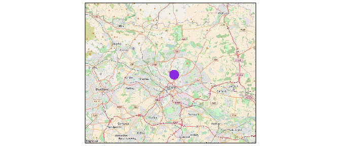

A comment on packages
---------------------

Note the use of the `::` operator in previous code chunks. These access the functions within the **sp** and **tmap** packages without having to load them, and highlight which packages the functions were taken from (it can get confusing with so many spatial packages floating around!). This can be useful if for one-off plots but generally it's best to load the package you'll use at the outset of each analysis and use the functions directly.

Dataset used and downloading them
---------------------------------

For consistency, we use a limited number of datasets, which share the same geographic extent (London), throughout this tutorial. We will be using real data related to transport planning. To make the tutorial more exciting, imagine that you are trying to present evidence to support policies that will enable Londoner to 'Go Dutch' and cycle as the main mode of transport. The datasets are as follows:

-   `lnd_crashes`: A `SpatialPointsDataFrame` from the 'Stats19' dataset on road traffic collisions reported to the police.
-   `lnd_commutes`: A `SpatialLinesDataFrame` representing commuter desire lines in London.
-   `lnd_rnet`: A network of lines representing the cycling potential in different parts of London.
-   `lnd_msoas`: Areas of London, stored as a `SpatialPolygonsDataFrame`.
-   `lnd_topo`: The topography of London, saved as a `RasterLayer`.

These were created/stored locally in the `vspd-base-shiny-data/` subdirectory of `vignettes/` the working directory of this tutorial. Set your working directly to this folder:

``` r
# switch to the vignettes directory if not in it already
if(!grepl(pattern = "vignettes", x = getwd())){
  old = setwd("vignettes")
}
```

**The datasets can all be downloaded from the following link: [github.com/Robinlovelace/vspd-base-shiny-data](https://github.com/Robinlovelace/vspd-base-shiny-data).**

They can be automatically downloaded and placed into the correct folder as follows:

``` r
u = "https://github.com/Robinlovelace/vspd-base-shiny-data/archive/master.zip"
download.file(u, destfile = "master.zip")
unzip("master.zip")
dir.create("vspd-base-shiny-data")
f = list.files(path = "vspd-base-shiny-data-master/", full.names = T)
file.copy(f, "vspd-base-shiny-data")
```

Once you have downloaded the datasets, they can be loaded with the following commands (see the Appendix for information on data provenance):

``` r
lnd = readRDS("vspd-base-shiny-data/lnd84.Rds")
lnd_crashes = readRDS("vspd-base-shiny-data/ac_cycle_lnd.Rds")
killed = lnd_crashes[lnd_crashes$Casualty_Severity == "Fatal",]
lnd_commutes = readRDS("vspd-base-shiny-data/l-lnd.Rds")
lnd_msoas = readRDS("vspd-base-shiny-data/z.Rds")
lnd_rnet = readRDS("vspd-base-shiny-data/rnet-lnd.Rds")
lnd_topo = readRDS("vspd-base-shiny-data/lnd-topo.Rds")
```

Base graphics
=============

``` r
library(sp)
```

Spatial datasets defined by **sp** classes can be plotted quickly using the base function `plot()`, after **sp** has been loaded:

``` r
plot(home)
```


To verify that **sp** provides this functionality, try 'unloading' the package:

``` r
detach("package:sp")
plot(home)
## Error in as.double(y) : 
##   cannot coerce type 'S4' to vector of type 'double'
library(sp)
```

`plot()` only works for `Spatial*` objects after **sp** has been loaded because of class-specific methods of `plot()` provided by **sp**. For details on these, it is instructive to take a look at the source code of **sp**. The below prints the source code of `plot.SpatialPoints().`.[1]

``` r
sp:::plot.SpatialPoints
```

    ## function (x, pch = 3, axes = FALSE, add = FALSE, xlim = NULL, 
    ##     ylim = NULL, ..., setParUsrBB = FALSE, cex = 1, col = 1, 
    ##     lwd = 1, bg = 1) 
    ## {
    ##     if (!add) 
    ##         plot(as(x, "Spatial"), axes = axes, xlim = xlim, ylim = ylim, 
    ##             ..., setParUsrBB = setParUsrBB)
    ##     cc = coordinates(x)
    ##     points(cc[, 1], cc[, 2], pch = pch, cex = cex, col = col, 
    ##         lwd = lwd, bg = bg)
    ## }
    ## <environment: namespace:sp>

This is the source code of **sp** that will run every time that an object of class `SpatialPoints` (or `SpatialPointsDataFrame`, which inherits `SpatialPoints`) is passed to `plot()`. Two main differences from this source code should be noted: `pch = 3` and `axes = FALSE`. This switches the symbol of the points to a cross and stops the graphic from containing intrusive axes. Another major difference is the addition of the `add` argument (set to `FALSE` by default).

To see the difference between the generic and **sp** versions of `plot()`, let's plot some points using both methods:

``` r
par(mfrow = c(1, 2))
plot(lnd_crashes)
plot(coordinates(lnd_crashes))
```

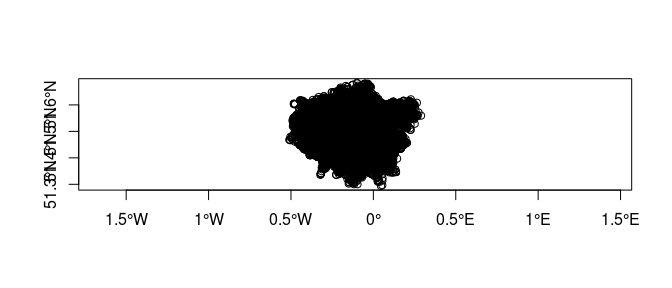

``` r
par(mfrow = c(1, 1))
```

It is instructive to realise that because any arguments available to `plot()` will work for plotting spatial data. Plots of spatial data using `plot()` are therefore as flexible as any `plot()`: very. The following, for example, makes the plot look more like the base version of `plot()`, with the major difference being that the axis breaks use degrees as their units and that the plot has the right height-width proportions:

``` r
plot(lnd_crashes, pch = 1, axes = T)
```

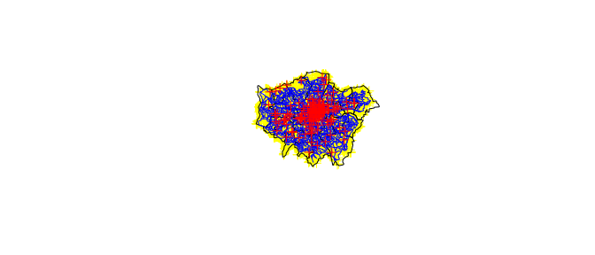

The above shows that although they *look* like base graphics, basic maps produced with `plot()` should technically be called '**sp** graphics'. Let's see what else these methods can do, by add polygon and line datasets to the mix:

``` r
plot(lnd_crashes, col = "yellow")
plot(lnd, add = T)
plot(lnd_rnet, add = T, col = "blue")
plot(lnd_crashes[lnd_crashes$Casualty_Severity == "Fatal",],
     col = "red", add = T)
```


The above code shows how the use of `add = TRUE` can be used to create a layered map, with each call to `plot()` overlaying the previous one. This is great for quickly visualising whether datasets spatially overlap. Be warned, however: any plot containing `add = T` will fail if a plot has yet to be called (a problem solved by **tmap** and **ggmap**).

The plots may look a little rudimentary and dated. However, the advantage is that if you are already good with base graphics, you will naturally be good at map making. If you are not proficient with R's base graphics, it is recommended that you skip this phase directly to something more sophisticated like **tmap**.

spplot
======

`spplot()` is an extension of base `plot()` provided by the **sp** package for plotting objects side-by-side. The plot below, for example, plots the spatial distribution of the age of casualty alongside the age of the vehicle driver.

``` r
spplot(obj = killed, c("Age_of_Casualty", "Age_of_Driver"))
```

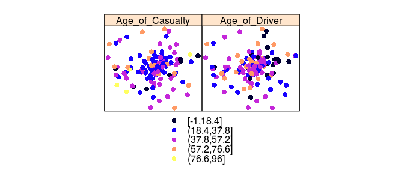

`spplot()` is a quick way to compare the spatial distribution of two variables within a spatial dataset. It is limited by the fact that the variables being compared must have range of values (or levels if they are factors). The following fails, for example:

``` r
spplot(obj = killed, c("Sex_of_Casualty", "Road_Type"))
# Error in stack.SpatialPointsDataFrame(as(data, "SpatialPointsDataFrame"),  : 
#   all factors should have identical levels
```

Due to these limitations we don't consider `spplot()` further in this tutorial. More recent packages offer a more intuitive interface for creating plots with aesthetically pleasing defaults. Furthermore **ggmap** and **tmap** packages also allow for faceted maps.

ggmap
=====

``` r
library(ggmap)
```

    ## Loading required package: ggplot2

**ggmap** provides a few extensions to the popular graphics library **ggplot2** to make it easier to make maps. It's main role from a visualisation perspective is to provide an easy way to create base-maps by automatically downloading tiles from services such as Google Maps. It is therefore sensible to simply experiment with **ggplot2** before testing out **ggmap**.

**ggmap** therefore has an emphasis on online data (e.g. providing `geocode()` and `route()` functionality) and basemaps rather than GIS. Unlike the other packages presented here, **ggmap** does not work with data of `Spatial*` classes directly: instead **ggmap**, like **ggplot2**, demands data frames.

``` r
# not shown
killed$lon = coordinates(killed)[,1]
killed$lat = coordinates(killed)[,2]
ggplot(data = killed@data, mapping = aes(lon, lat)) +
  geom_point() +
  coord_map()
```

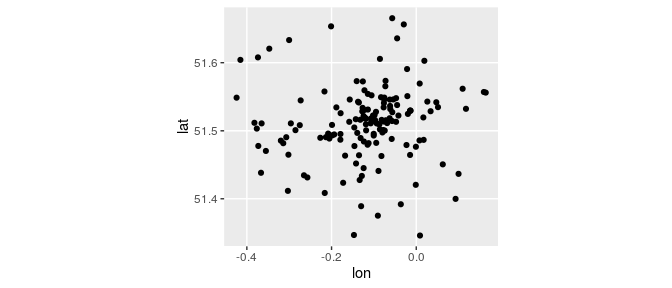

Note that the above code added the geometry data of the points to the data frame in the data slot of the `killed` geographic object, represented by `@data`. Because there is only one x/y (lon/lat in this case) pair for each row of data, this could be done by creating new columns. To convert more complex spatial data structures (`SpatialLinesDataFrames` and `SpatialPolygonsDataFrames`) into data frames, **ggmap** relies on `ggplot2::fortify()`, which is similar to `raster::geom()`:

``` r
library(maptools) # a dependency for fortify to work
```

    ## Checking rgeos availability: TRUE

``` r
lnd_fortified = fortify(lnd, region = "ons_label")
head(lnd_fortified)
```

    ##          long      lat order  hole piece   id  group
    ## 1 -0.11296835 51.51823     1 FALSE     1 00AA 00AA.1
    ## 2 -0.10534590 51.51854     2 FALSE     1 00AA 00AA.1
    ## 3 -0.09677876 51.52325     3 FALSE     1 00AA 00AA.1
    ## 4 -0.08521847 51.52033     4 FALSE     1 00AA 00AA.1
    ## 5 -0.07847170 51.52151     5 FALSE     1 00AA 00AA.1
    ## 6 -0.07271997 51.51023     6 FALSE     1 00AA 00AA.1

The output of `fortify()` is a data frame, as illustrated by its first 6 rows, shown above. Now rather than each row of data representing a London borough, each row in `lnd_fortified` now represents a single vertex on the `lnd` object. For this reason the data frame `lnd@data` has 33 whereas the `lnd_fortified` object has 1102 rows.

<!-- Todo: create a dataframe of lat/lon pairs other ways -->
Notice that `lnd_fortified` still lacks attribute data, which needs to be joined. We can use `dplyr::left_join()` to do this:

``` r
lnd_fortified = dplyr::left_join(lnd_fortified, lnd@data, c("id" = "ons_label"))
```

    ## Warning in left_join_impl(x, y, by$x, by$y, suffix$x, suffix$y): joining
    ## factor and character vector, coercing into character vector

``` r
ggplot(data = lnd_fortified, aes(long, lat)) +
  geom_polygon(aes(group = group, fill = Pop_2001)) +
  coord_map()
```

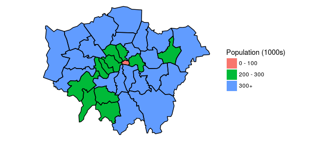

We can make this map look a little more finished by removing the distracting axis labels, adding borders to the boroughs and changing the legend of the population variable, as illustrated by the code chunk below.

``` r
pbreaks = c(0, 1e5, 2e5, 4e5)
plabs = c("0 - 100", "200 - 300", "300+")
lnd_fortified$`Population (1000s)` =
  cut(lnd_fortified$Pop_2001, breaks = pbreaks, labels = plabs)
ggplot(data = lnd_fortified, aes(long, lat, group = group)) +
  geom_polygon(aes(fill = `Population (1000s)`)) +
  geom_path() +
  coord_map() +
  theme_nothing(legend = T)
```

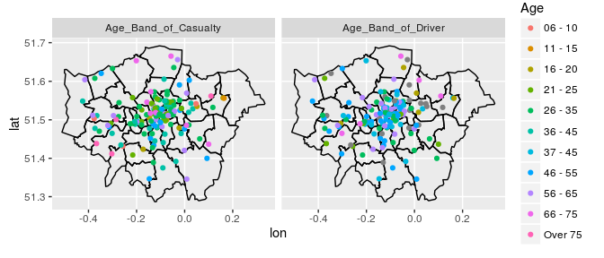

The above examples show that even though **ggplot2** was designed to make graphing as intuitive as possible, it still requires a decent amount of data preparation and domain-specific knowledge to create nice maps. Before moving on to **tmap**, which resolves some of these issues, we will reproduce the faceted map of the age/space distribution of victims/perpetrators in cycle/vehicle collisions. As you may have guessed, this also requires some data manipulation.

``` r
library(tidyr)
killed_df = dplyr::select(killed@data,
                   Age_Band_of_Casualty, Age_Band_of_Driver, lon, lat)
killed_df = gather(killed_df, Role, Age, -lon, -lat)
ggplot(killed_df, aes(lon, lat)) +
  geom_path(data = lnd_fortified,
               aes(long, lat, group = group)) +
  geom_point(aes(color = Age)) +
  facet_grid(. ~Role) +
  coord_map() 
```

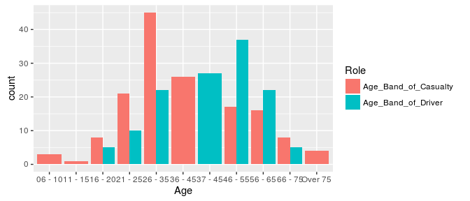

What just happened? The relevant data (selected with `dplyr::select()`) was reshaped into 'long' format using `tidyr::gather()`. The age bands were put in an ordered factor using the `factor()` function, and then the data was plotted using the `facet_grid()` function to split the map in two. The results show that young adults, particularly in the 21 to 35 year-old band, are disproportionately killed by older drivers. This result can also be visualised non-spatially with **ggplot2**, so your skills can be cross-transferable:

``` r
ggplot(data = killed_df) +
  geom_bar(aes(x = Age, fill = Role), position = "dodge")
```

    ## Warning: Removed 23 rows containing non-finite values (stat_count).

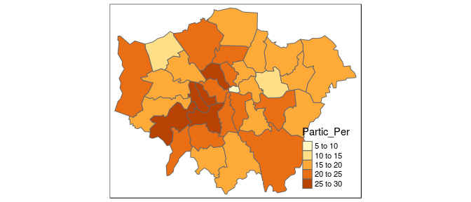

tmap
====

**tmap** is a recent package for spatial data visualisation that takes the best of both **ggplot2** and **sp** graphic worlds. Like **ggplot2** has an intuitive interface that uses the `+` symbol to build up layers. But, like **sp**'s `plot()` functions and unlike **ggplot2**, it works directly with spatial data classes. It is perhaps the quickest way to create a useful map in R, e.g. using the `qtm()` function:

``` r
library(tmap)
qtm(lnd, fill = "Partic_Per")
```


`qtm()` is a wrapper function for `tm_shape()`, which is analogous to the plot initialisation function `ggplot()` in **ggplot2**, and functions which draw the features, such as `tm_bubbles()`, `tm_lines()` and `tm_fill()` for plotting points, lines and polygons respectively (see `?vignette('tmap-nutshell')` for further information).

To see how **tmap** graphics are constructed, let's create an identical graphic the verbose way, changing the colorscheme of the fill and border width to give an indication of the kinds of thing that can be customised:

``` r
# Not shown
tm_shape(shp = lnd) +
  tm_fill("Partic_Per", palette = "BrBG") +
  tm_borders(lwd = 3)
```

Thus `tm_shape()` takes a spatial object and subsequent `tm_*()` functions take variable names contained in the `Spatial*DataFrame`. The `+` operator is very useful for building up plots one on top of another. Here is a **tmap** version of the multi-layered plot created towards the end of the base graphics section:

``` r
qtm(lnd_crashes, dot.col = "yellow") +
  tm_shape(lnd) + tm_borders() +
  tm_shape(lnd_rnet) + tm_lines("blue") +
  tm_shape(killed) + tm_dots(col = "red", size = 0.1)
```

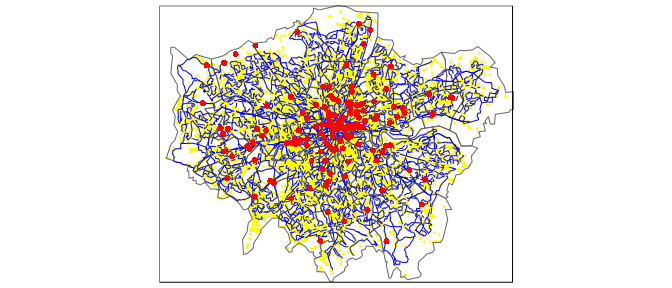

### Exercise

Compare the multi-layered output just created via **tmap** with the equivalent plot created using base graphics. Which do you prefer and why?

**tmap** has a concise interface to create faceted plots, as demonstrated above with **spplot** and **ggplot2**:

``` r
# Not shown
tm_shape(killed) +
  tm_dots(col = c("Age_of_Casualty", "Age_of_Driver"), size = 0.1)
```

This shows that to create a facetted plot, you just pass the names of the variables to the visualisation layer. The above example demonstrates another useful feature of **tmap**: if passed a continuous variable, it automatically created categories (bins) for the output, the `palette` (or colourscheme) of which can be controlled with `palette = "Reds"` The number and nature of the breaks can be controlled by the `n` and `style` arguments in the `tm_*` plotting functions. Setting `n = 4` and `style = "quantile"`, for example, would create bins with equal numbers of elements. Use `breaks` to manually set the location of the breaks. Use the additional function `tm_layout()` to control the layout of the plot. `tm_layout(legend.outside = T)`, for example, will create a self-standing legend outside the panel used by the map.

### Exercise

Experiment with the various plotting options within **tmap**, with reference to the [tmap vignette](https://mran.microsoft.com/web/packages/tmap/vignettes/tmap-nutshell.html) and examples (e.g. `example(tm_dots)`).

Without looking at the source code, try to replicate the map below (hint: the `auto.palette.mapping` argument may be useful).

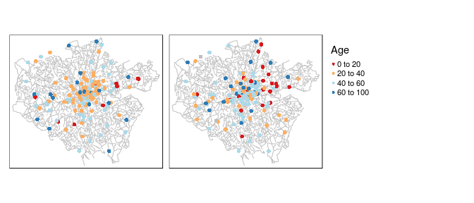

Interactive maps with tmap
--------------------------

To make an interactive map with **tmap**, enter `tmap_mode("view")` and run the same code you have been using for static maps. Below is an example of the multi-layered plot of London used previously:

``` r
tmap_mode("view")
qtm(lnd_crashes, dot.col = "yellow") +
  tm_shape(lnd) + tm_borders() +
  tm_shape(lnd_rnet) + tm_lines("blue") +
  tm_shape(killed) + tm_dots(col = "red", size = 0.1)
tmap_mode("plot") # return to plotting mode
```

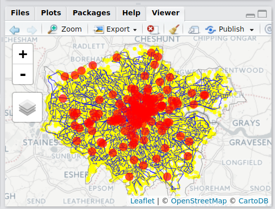

### Exercise

Try to publish one of the interactive maps you created during this tutorial online. This can either be done automatically if you have an RPubs account and are running RStudio, or can be done via the `save_tmap()`, as demonstrated below.

``` r
tmap_mode("view")
m = qtm(killed)
save_tmap(m, "/path-to/www/map.html")
```

leaflet
=======

**leaflet** is an R package for interacting with the Leaflet JavaScript library. It creates an object of class `htmlwidget` that is automatically displayed in RStudio, as illustrated below.

``` r
library(leaflet)
m = leaflet() %>%
  addTiles() %>%
  addCircles(data = killed)
class(m)
```

    ## [1] "leaflet"    "htmlwidget"

``` r
# m # uncomment to print the map
```

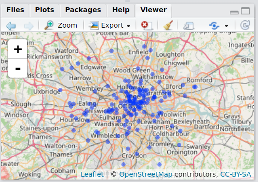

There is much to say about **leaflet**. It is an excellent package on which all other interactive mapping approaches covered in this tutorial (**tmap**, **mapview**, **shiny**) use. Rather than cover the material here, I suggest checking out and working-through the excellent online tutorial on **leaflet** at [rstudio.github.io/leaflet/](https://rstudio.github.io/leaflet/).

mapview
=======

**mapview** provides convenient wrappers around **leaflet** to ease the creation of interactive maps. While the **leaflet** map example took 3 functions to create, with mapview (like tmap) you can do it with just one:

``` r
library(mapview)
```

``` r
m = mapview(killed) +
  mapview(lnd_commutes, color = "red")
m # display the map
```

As well as providing the option to save in html (via `htmlwidgets::saveWidget(m@map, "m.html")`), the `mapshot()` function allows you to save a snapshot of you map at it's initial zoom level:

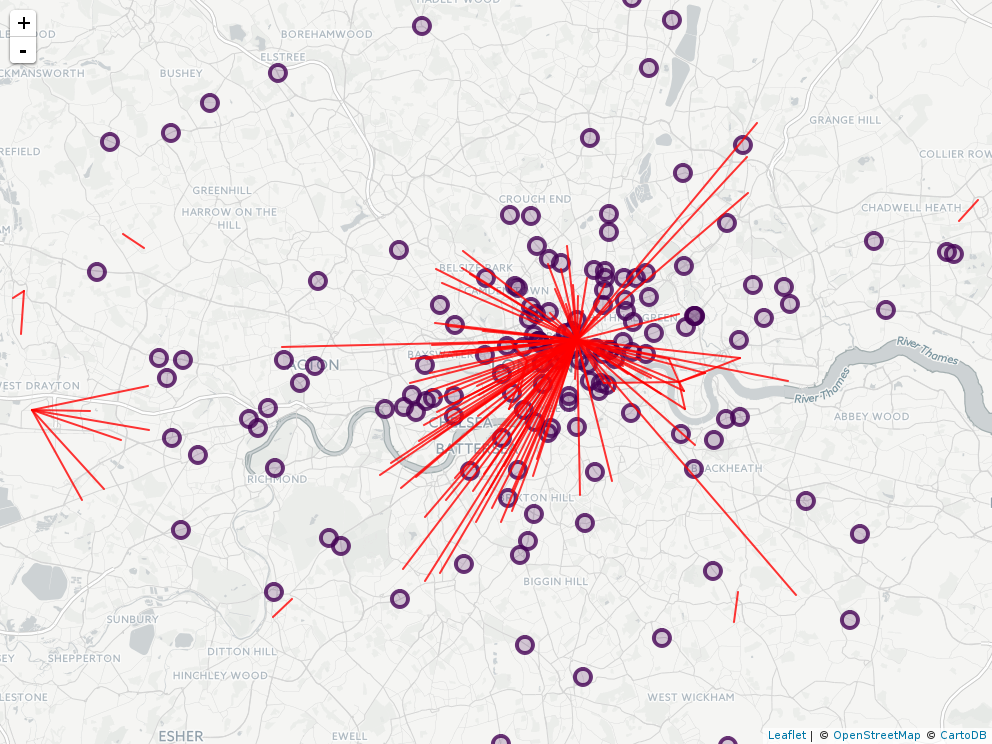

shiny
=====

**shiny** is a package for creating interactive web applications in R. During the tutorial we will create a web application to explore cycling levels and cycling safety in London.

The first stage is to create a 'minimum viable product', to allow us to view where cycle crashes happen over time. There are two basic components every **shiny** app:

1.  The code that defines the user interface on the 'client side' (commonly stored in a file called `ui.R`)
2.  The code that actually does the 'heavy lifting' on the server side, running R instances through software called [shiny-server](https://github.com/rstudio/shiny-server).

We will develop the full application in a folder called `cycleViz` but for the the purposes of prototyping we will develop each component together. Still, it's good practice to make an early start to show where we intend to get to. The following code will create the app folder and populate it with the most basic of shiny apps:

``` r
dir.create("cycleViz")
shiny_d = system.file(package = "shiny", "examples/01_hello/")
f = list.files(shiny_d, pattern = "*.R$", full.names = T)
file.copy(f, "cycleViz")
## [1] TRUE TRUE
```

If the above code worked, congratulations: you have a working shiny app in your working directory, that you can use for the development of a full app. Now test it, and you should see something like the image below:

``` r
library(shiny)
runApp("cycleViz/")
```

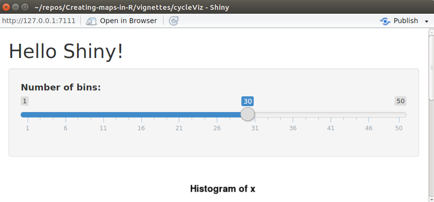

For the purposes of prototyping, we can create the app in-line with

``` r
library(shiny)
library(leaflet)
# Define UI
ui = fluidPage(
  sidebarPanel(
    sliderInput(inputId = "year", label = "Year of casualty:",
                value = 2010, min = 2005, max = 2014)
  ),
  # Show a plot of the generated distribution
  mainPanel(
    leafletOutput("map")
  )
)

# Define server logic
server <- shinyServer(function(input, output) {
  p = readRDS("vspd-data/ac_cycle_lnd.Rds")
  output$map = renderLeaflet({
    leaflet() %>%
      addProviderTiles("Thunderforest.OpenCycleMap") %>% 
      setView(lng = -0.1, lat = 51.5, zoom = 10)
    })
  observe({
    leafletProxy("map") %>% clearShapes()%>%
      addCircles(data = p[grepl(input$year, p$Date),])
  })
})

# Run the application 
shinyApp(ui, server)
```

<!-- # Appendix -->
<!-- The datasets used in this tutorial were downloaded using the code presented below: -->
<!-- ```{r, eval=FALSE} -->
<!-- u1 = "https://github.com/npct/pct-data/raw/master/london/l.Rds" -->
<!-- download.file(u1, "vspd-base-shiny-data/l-lnd.Rds") -->
<!-- u2 = "https://github.com/npct/pct-data/raw/master/london/z.Rds" -->
<!-- download.file(u2, "vspd-base-shiny-data/z.Rds") -->
<!-- u3 = "https://github.com/npct/pct-data/raw/master/london/rnet.Rds" -->
<!-- download.file(u3, "vspd-base-shiny-data/rnet-lnd.Rds") -->
<!-- u4 = "https://data.gov.uk/dataset/road-accidents-safety-data/datapackage.zip" -->
<!-- download.file(u4, "vspd-base-shiny-data/datapackage-stats19.zip") # warning: downloads 0.5 GB -->
<!-- # subsetting the data -->
<!-- l = readRDS("vspd-base-shiny-data/l-lnd.Rds") -->
<!-- lnd_commutes = l[l$all > 500,] -->
<!-- saveRDS(lnd_commutes, "vspd-base-shiny-data/l-lnd.Rds") -->
<!-- sp::plot(lnd_commutes) -->
<!-- rnet = readRDS("vspd-base-shiny-data/rnet-lnd.Rds") -->
<!-- summary(rnet$dutch_slc) -->
<!-- rnet$length = stplanr::gprojected(rnet, fun = rgeos::gLength, byid = T) -->
<!-- summary(rnet$length) -->
<!-- lnd_rnet = rnet[rnet$dutch_slc > 1000 | rnet$length > 500,] -->
<!-- saveRDS(lnd_rnet, "vspd-base-shiny-data/rnet-lnd.Rds") -->
<!-- ``` -->
<!-- The Stats19 data required processing before it could be used: -->
<!-- ```{r, eval=FALSE} -->
<!-- library(stplanr) -->
<!-- library(dplyr) -->
<!-- unzip("vspd-base-shiny-data/datapackage-stats19.zip") -->
<!-- unzip("vspd-base-shiny-data/Stats19_Data_2005-2014.zip") -->
<!-- ac = read_stats19_ac(data_dir = ".") -->
<!-- ca = read_stats19_ca(data_dir = ".") -->
<!-- ve = read_stats19_ve(data_dir = ".") -->
<!-- levels(ve$Age_Band_of_Driver)[2:3] = c("01 - 05",  "06 - 10") -->
<!-- levels(ca$Age_Band_of_Casualty)[2:3] = c("01 - 05",  "06 - 10") -->
<!-- ve_not_cycle = filter(ve, Vehicle_Type != "Pedal cycle") -->
<!-- ve_not_cycle = ve_not_cycle[!duplicated(ve_not_cycle$Accident_Index),] -->
<!-- ac_joined = inner_join(ac, ca, "Accident_Index") -->
<!-- ac_cycle = filter(ac_joined, Casualty_Type == "Cyclist") -->
<!-- ac_cycle = filter(ac_cycle, !is.na(Latitude)) -->
<!-- ac_cycle = left_join(ac_cycle, ve_not_cycle, "Accident_Index") -->
<!-- summary(ac_cycle$Vehicle_Type) -->
<!-- summary(ac_cycle$Casualty_Severity) -->
<!-- # ac_cycle_sev = filter(ac_cycle, Casualty_Severity == "Fatal" | -->
<!-- #                         Casualty_Severity == "Serious") -->
<!-- lnd = readRDS("../data/lnd84.Rds") -->
<!-- ac_cycle_sp = SpatialPointsDataFrame( -->
<!--   coords = cbind(ac_cycle$Longitude, ac_cycle$Latitude), -->
<!--   data = as.data.frame(ac_cycle), # fails if it's a tibble -->
<!--   proj4string = CRS(proj4string(lnd)) -->
<!-- ) -->
<!-- lnd_crashes = ac_cycle_sp[lnd,] -->
<!-- plot(lnd_crashes) # nearly 40k cyclist casualties -->
<!-- object.size(lnd_crashes) / 1000000 -->
<!-- names(lnd_crashes) -->
<!-- # lnd_crashes$Age_of_Casualty[lnd_crashes$Age_of_Casualty == -1] -->
<!-- lnd_crashes$Age_Band_of_Driver[is.na(lnd_crashes$Age_Band_of_Driver)] = factor(NA) -->
<!-- levels(lnd_crashes$Age_Band_of_Casualty) -->
<!-- lnd_crashes@data = select(lnd_crashes@data, -->
<!--                            Accident_Index, -->
<!--                            Date, -->
<!--                            Day_of_Week, -->
<!--                            Time, -->
<!--                            Road_Type, -->
<!--                            Age_of_Casualty, -->
<!--                            Age_Band_of_Casualty, -->
<!--                            Sex_of_Casualty, -->
<!--                            Casualty_Severity, -->
<!--                            Age_of_Driver, -->
<!--                            Age_Band_of_Driver -->
<!--                            ) -->
<!-- saveRDS(lnd_crashes, "vspd-base-shiny-data/ac_cycle_lnd.Rds") -->
<!-- ``` -->
<!-- The topographical data was saved using the **raster** package: -->
<!-- ```{r, eval=FALSE} -->
<!-- eng_topo = raster::getData("alt", country = "GBR") -->
<!-- lnd_topo = raster::crop(eng_topo, lnd) -->
<!-- plot(lnd_topo) -->
<!-- points(killed) -->
<!-- saveRDS(lnd_topo, "vspd-base-shiny-data/lnd-topo.Rds") -->
<!-- ``` -->

[1] Note that this function `sp:::plot.SpatialPoints()` must be accessed using the `:::` operator because it is not exported from **sp**. Why? The function is called automatically when `plot()` is called on a `SpatialPoints` object, taking advantage of R's *polymorphic* design as it is not designed to be used.
